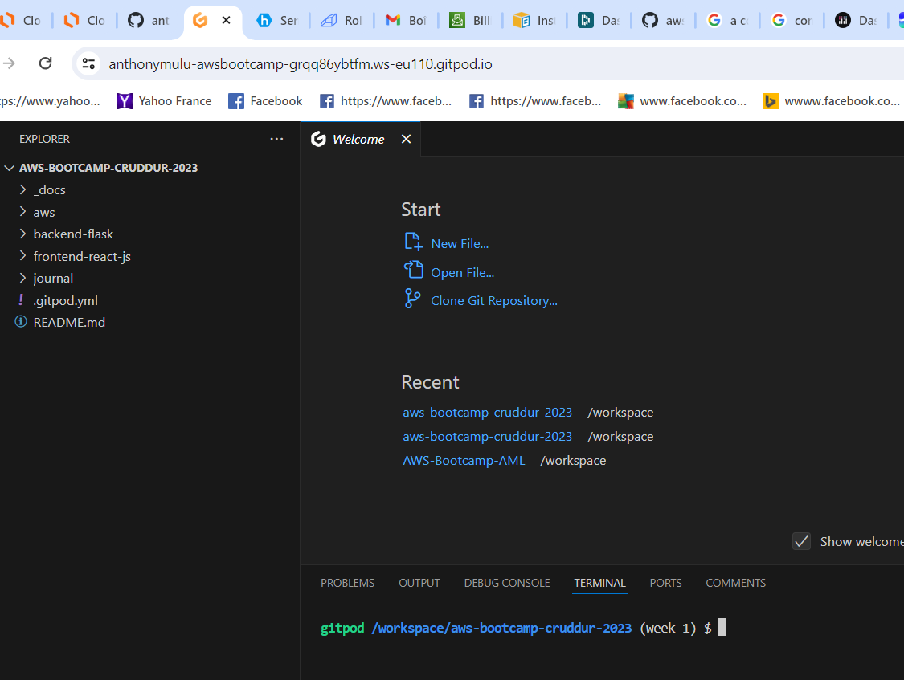

# Week 0 — Billing and Architecture

## Homework bootcamp

### Install AWS CLI

#### INSTALL AWS CLI ON GITPOD CDE (VSCODE)

In My Github code Repository, I need to click on Open Gitpod Button.
It will open my code repository on VSCODE install on Gitpod. see the screenshot below :



The current path, is the path that will automatically commit code to github when a change is made on it.
Therefore, to install the AWS CLI, I need to do "cd.." to getback to the workspace directory where I can install AWS CLI.

To install the aws cli I go to the following link [AWS CLI INSTALL DOCUMENTATION PAGE](https://docs.aws.amazon.com/cli/latest/userguide/getting-started-install.html) 

To use the aws cli command I go to the link [AWS DOCUMENTATION CLI](https://docs.aws.amazon.com/cli/latest/reference/) 

```
gitpod /workspace$ curl "https://awscli.amazonaws.com/awscli-exe-linux-x86_64.zip" -o "awscliv2.zip"
gitpod /workspace$ unzip awscliv2.zip
gitpod /workspace$ sudo ./aws/install
```
#### AFTER THE INSTALLATION COMPLETED, We need to configure credential in order to use aws API
```
gitpod /workspace$ export AWS_ACCESS_KEY_ID="***************"
gitpod /workspace$ export AWS_SECRET_ACCESS_KEY="*************************"
gitpod /workspace$ export AWS_DEFAULT_REGION="us-east-1"

gitpod /workspace $ aws sts get-caller-identity
{
    "UserId": "*******************",
    "Account": "******************",
    "Arn": "arn:aws:iam::************:user/username"
}
```

#### If we don't want to loose our gitpod configuration online, we need to create a file nemed .gitpod.yml with following contents :
```
tasks:
  - name: aws-cli
    env:
      AWS_CLI_AUTO_PROMPT: on-partial
    init: |
      cd /workspace
      curl "https://awscli.amazonaws.com/awscli-exe-linux-x86_64.zip" -o "awscliv2.zip"
      unzip awscliv2.zip
      sudo ./aws/install
      cd $THEIA_WORKSPACE_ROOT
```

#### To persist env variable we did set up by doing export AWS_DEFAULT_REGION="us-east-1" for instance, we need to do the following command instead on Gitpod
```
gitpod /workspace$ gp env AWS_ACCESS_KEY_ID="AK******************"
gitpod /workspace$ gp env AWS_SECRET_ACCESS_KEY="U9ZU5b*********************"
gitpod /workspace$ gp env AWS_DEFAULT_REGION="us-east-1"
gitpod /workspace$ gp env AWS_ACCOUNT_ID="***********"
```

#### To commit in a different branch named week-1
```
gitpod /workspace $ cd aws-bootcamp-cruddur-2023/
gitpod /workspace/aws-bootcamp-cruddur-2023 (main) $ git checkout -b week-1

gitpod /workspace/aws-bootcamp-cruddur-2023 (week-1) $
```
#### From here, I commit the .gitpod.yml file

### CREATE A BUDGET; we should go to AWS CLI documentation :
- create the folder aws/json in side the project
- Add following two files : budget.json and budget-notifications-with-subscribers.json
- insert command gotten from the AWS CLI documentation

#### execute the following commands :
```
aws budgets create-budget \
    --account-id $AWS_ACCOUNT_ID \
    --budget file://aws/json/budget.json \
    --notifications-with-subscribers file://aws/json/budget-notifications-with-subscribers.json
```
#### How to upload file on github

**GO TO** 
/Journal/ and create an assets folder like the following
aws-bootcamp-cruddur-2023/journal/assets/.keep
commit the change and the new folder assets will appear there
Go to that folder assets and upload file (images) you want to upload


#### GREAT TOOL : AWS CALCULATOR


